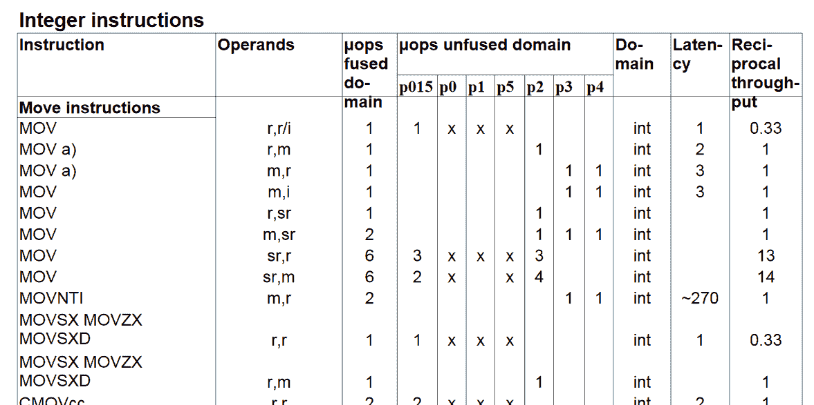

# Funzionamento di un compilatore

-   Un compilatore è un *traduttore*, che converte un linguaggio in un
    altro.
-   I compilatori C++ come `g++` e `clang++` convertono il C++ in
    *linguaggio macchina*.
-   Per capire come funziona un compilatore, bisogna comprendere il
    linguaggio macchina delle CPU!

# Cosa fa la CPU

-   Esegue sequenze di istruzioni
-   Accede a periferiche attraverso dei *bus*
-   **Accede alla memoria**: fondamentale!

# Tipi di memoria

-   **Memoria volatile**:
    -   Registro (qualche kB, 64 bit/ciclo)
    -   Cache (128 kB–128 MB, 40-700 GB/s)
    -   RAM (10 GB/s)
-   **Memoria permanente**:
    -   Disco fisso SSD (1 GB/s)
    -   Disco fisso HDD (120 MB/s)

# Memoria volatile

**Registri**

:    Attraverso identificativi come `ebp`, `rsp`, `eax`…
    (interi), `xmm0`, `xmm1`, … (floating point)

**Cache**

:    Esclusiva pertinenza della CPU!

**RAM**

:    **RAM**: la CPU richiede il dato al bus della memoria specificando
     l'indirizzo numerico
    
#

----------------------------------------- ------------------- -------------------------
{ height="128px" } Registri (6 kB)     { height="128px" }
 { height="128px" } RAM (8 GB)          { height="128px" }
  { height="128px" } HD SSD da 1 TB      { height="128px" }
----------------------------------------- ------------------- -------------------------

# Assembler

-   Il linguaggio macchina è espresso come una sequenza di bit: `0110101110…`
    
-   Può essere «traslitterato» partendo dal linguaggio assembler
    (usando compilatori come [NASM](https://www.nasm.us/) e
    [YASM](https://yasm.tortall.net/)):

    ```asm
    movapd xmm4, xmm1
    mulsd xmm5, xmm0
    mulsd xmm4, xmm1
    jle .L10
    movapd xmm6, xmm5
    ```

-   CPU diverse hanno convenzioni diverse per il linguaggio assembler

# Cosa sa fare la CPU?

-   Calcoli elementari su interi
-   Calcoli elementari su floating-point
-   Confronti
-   Istruzioni di salto (`goto`)
-   Copia di dati da RAM a registri e viceversa
-   Comunicazione attraverso i bus: hard disk, scheda grafica,
    tastiera, mouse, porte ethernet, etc.
    
# Cosa *non* sa fare la CPU?

-   Cicli `for`
-   Operazioni matematiche complesse (es., `2 * x + y`)
-   Gestione di dati complessi (array, stringhe, etc.)
-   Allocazione di memoria con `new` e `delete`
-   Funzioni con parametri
-   Classi
-   Molto altro!

#

-   In passato, per molti computer era necessario programmare
    direttamente in Assembler. Solo pochi pionieri offrivano linguaggi
    ad alto livello, come il Commodore 64:
    
    { width="40%" }

-   Ma già dagli anni '50 si erano sviluppati linguaggi *ad alto
    livello*, come **Lisp** e **Fortran**

# Compilatori

-   Un compilatore traduce il codice di un linguaggio ad alto livello
    (come il C++) in codice macchina
-   Trasforma cicli `for` in cicli che usano `goto`
-   Decide autonomamente quando usare i registri e quando la RAM
-   Per ogni architettura è necessario che il compilatore sappia
    generare l'assembler corrispondente. Le architetture più diffuse
    sono:
    -    x86_64: usata nella maggior parte dei desktop e dei laptop
    -    ARM: usata soprattutto nei cellulari e nei tablet, ma anche
         in console di gioco (Nintendo Switch) e alcuni laptop
         (Chromebooks)
    
# Esplorare il codice assembler

-   Molti compilatori possono produrre file di testo con l'assembler
    generato, prima della traduzione in linguaggio macchina
-   Se usate `gcc` e `clang`, esiste il flag `-S`
-   Potete fare esperimenti online sul sito
    [godbolt.org](https://godbolt.org) (che ho usato per le prossime
    slide)

# Esempio: un ciclo `for`

<table width="100%">
<tr>
<td>
**C++**
</td>
<td>
**Assembler** (x86_64)
</td>
</tr>
<tr>
<td>
```c++
for (int i = 0; i < n; ++i)
{
    // loop body
}
```
</td>
<td>
```asm
    mov  ecx, [n]
    xor  eax, eax
LoopTop:
    cmp  eax, ecx
    jge  LoopEnd
    ; (loop body: DO NOT MODIFY ecx!)
    add  eax, 1
    jmp  LoopTop
LoopEnd:
    ; (etc.)
```
</td>
</tr>
</table>

# Uso di registri

-   Per ogni dato, il compilatore deve decidere se usare un registro o
    la RAM
-   Trovare la scelta ottimale è molto difficile (vedi
    [Wikipedia](https://en.wikipedia.org/wiki/Register_allocation))
-   In passato il C/C++ offriva la parola chiave `register` (oggi
    deprecata):
    
    ```c
    void fn(void) {
        int a, b;
        register int i; /* Put this variable in a register, if possible */
        /* … */
    }
    ```

# Frattali di Julia

#

{height="512px"}

#

-   Un [frattale di Julia](https://en.wikipedia.org/wiki/Julia_set)
    $J_c$ è un sottoinsieme del piano complesso $\mathbb{C}$,
    parametrizzato da $c \in \mathbb{C}$.
-   Un punto $z \in \mathbb{C}$ appartiene a $J_c$ sse
    $$\lim_{n\rightarrow\infty} \left|f^{(n)}(z)\right| < \infty,$$
    dove $f^{(n)}$ indica la funzione $f$ composta $n$ volte:
    $f(f(f(\ldots)))$, e $f(z) = z^2 + c$.
-   Un teorema afferma che, se $\exists n: \left|f^{(n)}(z)\right| >
    R$, con $R^2 - R \geq \left|c\right|$, allora il limite sopra
    diverge (quindi $J_c$ è *limitato*).

# Frattali di Julia in C++

```c++
int julia(double startx, double starty, double cx, double cy, int max_iter = 1024) {
    int iter = 0;
    double zx = startx, zy = starty;
    while ((zx * zx + zy * zy < 4) && (iter < max_iter)) {
        double tmp = zx * zx - zy * zy;
        zy = 2 * zx * zy + cy;
        zx = tmp + cx;

        iter++;
    }

    return (iter == max_iter) ? -1 : iter;
}
```

(Evitiamo di usare `#include <complex>` perché così è più semplice
capire il codice assembler).

# Codice assembler (`-O0`)

<table width="100%">
<tr>
<td>
**C++**
</td>
<td>
**Assembler**
</td>
</tr>
<tr>
<td>
```c++
zy = 2 * zx * zy + cy;
```
</td>
<td>
```asm
movsd xmm0, QWORD PTR [rbp-24]  ; xmm0 = zx
addsd xmm0, xmm0                ; xmm0 += xmm0
mulsd xmm0, QWORD PTR [rbp-16]  ; xmm0 *= zy
addsd xmm0, QWORD PTR [rbp-64]  ; xmm0 += cy
movsd QWORD PTR [rbp-16], xmm0  ; zy = xmm0
```
</td>
</tr>
</table>

Con `-O2` il codice si complica, perché il compilatore cerca di usare
più i registri, come `xmm0`, che gli accessi alla memoria RAM, come
`[rbp-16]`.

#



#

{height="200px" valign="bottom"}

Flag   Tempo
-----  -------
`-O0`  0.23 s
`-O1`  0.13 s
`-O2`  0.11 s
`-O3`  0.11 s


# Produrre codice assembler

-   Il compilatore `g++` si basa su [GCC](https://gcc.gnu.org/), che
    implementa una serie di algoritmi per capire quale sia il modo più
    performante di usare i registri e ordinare le istruzioni
-   Il compilatore `clang` si basa sulla libreria
    [LLVM](https://llvm.org/), che prende in input una descrizione «ad
    alto livello» della sequenza di operazioni da eseguire e le
    traduce in codice assembler ottimizzato

# Altri linguaggi

-   Il compilatore [GCC](https://gcc.gnu.org/) supporta molti
    linguaggi oltre al C++, usando lo stesso generatore di codice
    assembler: C e Objective-C (`gcc`),
    [D](https://wiki.dlang.org/GDC) (`gdc`),
    [Go](https://gcc.gnu.org/onlinedocs/gcc-9.3.0/gccgo/) (`gccgo`),
    [Fortran](https://gcc.gnu.org/onlinedocs/gcc-9.3.0/gfortran/)
    (`gfortran`),
    [Ada](https://gcc.gnu.org/onlinedocs/gcc-9.3.0/gnat_ugn/)
    (`gnat`).
-   La libreria LLVM è impiegata da molti compilatori:
    [clang](https://clang.llvm.org/) (C/Objective-C/C++),
    [LDC](https://wiki.dlang.org/LDC) (D),
    [flang](https://github.com/flang-compiler/flang) (Fortran),
    [Crystal](https://crystal-lang.org/), [Swift](https://swift.org/),
    [Rust](https://www.rust-lang.org/), [Zig](https://ziglang.org/),
    [Julia](https://julialang.org/)
-   Altri compilatori implementano un proprio generatore di codice
    assembler: [FreePascal](https://freepascal.org/),
    [DMD](https://dlang.org/) (D), [Go](https://golang.org/), [Visual
    Studio](https://visualstudio.microsoft.com/vs/) (C/C++), etc.
-   Alcuni linguaggi, come [Nim](https://nim-lang.org/), producono
    codice C, che va poi compilato da un compilatore C.

# Cross-compilazione

-   In passato l'architettura dominante per le CPU nei computer era la
    Intel/AMD, denominata x86 (32-bit) o x86_64 (64-bit)
-   Con la diffusione di smartphone e tablet, l'architettura ARM ha
    avuto un'enorme diffusione
-   È diventato importante compilare codici per più architetture in
    modo facile e veloce
-   Un **cross-compilatore** permette di produrre codice
    assembler/macchina per un'architettura diversa da quella su cui il
    compilatore funziona
