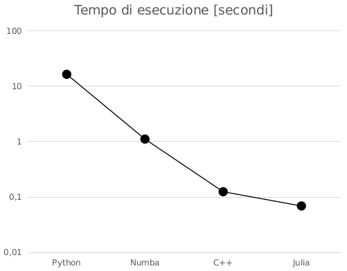

# Cos'è Julia?

-   [julialang.org](https://julialang.org/)
-   Linguaggio molto recente (versione 0.1 rilasciata a Febbraio 2013)
-   Pensato espressamente per il calcolo scientifico
-   Veloce come C++ e facile come Python…?
-   Versione corrente: 1.4.1

# Dove si colloca Julia?

Compilatori

: C, C++, FreePascal, gfortran, Rust, GNAT Ada, Nim, …

Interpreti

: CPython, R, Matlab, IDL, …

Just-in-time compilers

: Java, LuaJIT, Julia, etc.

# Un assaggio del linguaggio

```julia
f(x) = 3x^2                  # Functions can be defined on one line!

g(t, ν) = sin(2π * t * ν)    # You can use Unicode characters

x = Float64[1.0, 3.0, 4.0]   # Lists are supported natively

sin.(x)                      # Using ".", functions can be applied to arrays

⊕(x, y) = 2x + y            # New operators can be defined!

3 ⊕ 2                       # Prints 8
```

# Come funziona?

-   I tipi delle variabili sono (solitamente) non indicati
-   Il codice viene trasformato in un AST (Abstract Syntax Tree)
-   Quando una funzione viene eseguita:
    -   Se non è mai stata eseguita prima, il compilatore compila
        l'AST in codice assembler ottimizzato usando LLVM
    -   Altrimenti, riutilizza il codice assembler già pronto

# Sessione interattiva

```
$ julia
               _
   _       _ _(_)_     |  Documentation: https://docs.julialang.org
  (_)     | (_) (_)    |
   _ _   _| |_  __ _   |  Type "?" for help, "]?" for Pkg help.
  | | | | | | |/ _` |  |
  | | |_| | | | (_| |  |  Version 1.4.1 (2020-04-14)
 _/ |\__'_|_|_|\__'_|  |  Official https://julialang.org/ release
|__/                   |

julia>
```

# Definire funzioni

```
julia> mysum(a, b) = a + b
mysum (generic function with 1 method)

julia> mysum(1, 2)
3

julia> mysum(1.0, 2.0)
3.0

julia> mysum(1//3, 3//4)
13//12

julia> mysum(3+2im, 4-3im)
7 - 1im
```

Apparentemente, funziona come Python!

# Uso di LLVM

```
julia> @code_native mysum(1, 2)
	.text
; ┌ @ REPL[1]:1 within `mysum'
; │┌ @ REPL[1]:1 within `+'
	leaq	(%rdi,%rsi), %rax
; │└
	retq
	nopw	%cs:(%rax,%rax)
	nop
; └
```

(L'uso di `leaq` anziché `add` è un'ottimizzazione di LLVM).

# Uso di LLVM

```
julia> @code_native mysum(1.0, 2.0)
	.text
; ┌ @ REPL[1]:1 within `mysum'
; │┌ @ REPL[1]:1 within `+'
	vaddsd	%xmm1, %xmm0, %xmm0
; │└
	retq
	nopw	%cs:(%rax,%rax)
	nop
; └
```

# Esempio: frattale di Julia

```julia
function julia(start, c, max_iter)
    iter = 1
    z = start
    while (abs2(z) < 4.0) && (iter <= max_iter)
        z = z * z + c
        iter += 1
    end

    iter > max_iter ? -1 : iter
end
```

# Velocità di esecuzione



Tempo di esecuzione: 0.07 s (meglio del C++!)

# Impiego di Julia

-   Julia *non* compila i programmi in un eseguibile, come il C++
-   La compilazione avviene quando il codice viene eseguito la prima
    volta
-   Invocare il comando `import Plots; plot(…)` all'avvio richiede
    **14 secondi**; chiamare altre volte `plot` è invece immediato
-   Di conseguenza, Julia **non** va generalmente usato come C++ o
    come Python:

    ```sh
    $ gcc -o progr progr.cc  # Ok, create an executable
    $ ./progr                # Ok, run it

    $ python progr.py        # Ok, run it
    
    $ julia progr.jl         # Aaaargh! Every time it recompiles everything!
    ```

# Usare Julia al meglio

-   Per usare Julia al meglio, occorre avviare la REPL col comando
    `julia`, e poi eseguire i programmi col comando
    `include("nomefile")`
-   In questo modo, `nomefile` viene compilato la prima volta, ma poi
    viene sempre rieseguita la versione già compilata
-   Si eseguono comandi come `import Plots` una volta sola, così poi
    restano compilati per il resto della sessione

# Omoiconicità

#

-   Omoiconicità: «stessa rappresentazione»
-   I linguaggi omoiconici rappresentano nello stesso modo variabili e
    codice
-   I linguaggi *non* omoiconici permettono di usare costrutti come
    `if`, `for`, `while` solo su valori di variabili
-   Probabilmente l'unico vero linguaggio omoiconico è LISP, ma
    linguaggi come Julia prendono ispirazione da esso
    
# Esercizio 1

```c++
void f(int a) {
    // ????
}
int main() {
    f(2 + 2); // Should print "A"
    f(2 * 2); // Should print "B"
    f(4); // Should print "B"
}
```

Come si può scrivere una funzione `f` che stampa `A` se l'argomento è
calcolato mediante una somma, e `B` altrimenti?

# Soluzione in Julia

```julia
macro f(e::Expr)
    if e.args[1] == :+
        println("A")
    else
        println("B")
    end
end

@f 2 + 2   # Prints "A"
@f 2 * 2   # Prints "B"
```

# Manipolazione di espressioni

```
julia> expression = :(a + b / 2)   # :() means "quote"
:(a + b / 2)

julia> dump(expression)
Expr
  head: Symbol call
  args: Array{Any}((3,))
    1: Symbol +
    2: Symbol a
    3: Expr
      head: Symbol call
      args: Array{Any}((3,))
        1: Symbol /
        2: Symbol b
        3: Int64 2
```

# Manipolazione di espressioni

```
julia> expression
:(a + b / 2)

julia> a = 1; b = 2; eval(expression)
2.0

julia> expression.args[1] = :*
:*

julia> expression
:(a * (b / 2))

julia> eval(expression)
1.0
```

# Applicazioni

-   Calcolo esatto di derivate, integrali, etc.
-   Machine learning (uno degli obbiettivi del LISP!)
-   Definizione di costrutti nuovi per il linguaggio:

    ```julia
    # See https://docs.juliaplots.org/latest/animations/
    
    …
    anim = @animate for i ∈ 1:n
        circleplot(x, y, i)
    end
    gif(anim, "anim_fps15.gif", fps = 15)
    ```

# Multiple dispatch

# Multiple dispatch

-   Approccio alternativo alla programmazione ad oggetti
-   Forse la caratteristica più importante di Julia
-   «Julia: come for the speed, stay for multiple dispatch!»

# Ripasso di OOP

-   Paradigma nato negli anni '90
-   Incapsulamento, ereditarietà, polimorfismo:
    -   Dati e codice sono uniti in *classi*
    -   Le classi possono essere derivate
    -   Lo stesso metodo viene gestito diversamente a seconda della
        classe (tramite metodi `virtual` in C++)
-  OOP è supportata da molti linguaggi: C++, Python, Java, C#, etc.

# Esempio di OOP

```c++
struct FunzioneBase {
    virtual double Eval(double x) = 0;
};

struct Seno : public FunzioneBase {
    virtual double Eval(double x) { return sin(x); }
};

struct Coseno : public FunzioneBase {
    virtual double Eval(double x) { return cos(x); }
};
```

# Esempio di OOP

```c++
int main(int argc, const char *argv[]) {
    FunzioneBase *f = nullptr;
    if (argv[1] == "0") {
        f = new Seno();
    else {
        f = new Coseno();
    }
    std::cout << f->Eval(0.3) << "\n";
}
```

In fase di compilazione, il compilatore non può sapere se verrà usato
`Seno` o `Coseno`: questo viene deciso a *runtime*.

# Ripasso di OOP

-   Vantaggi:
    -   Maggiore riusabilità del codice
    -   Responsabilità ben separate tra classi
-   Svantaggi:
    -   Costruire gerarchie di classi è complicato
    -   La riusabilità è spesso una chimera

# Riusabilità del codice

-   Supponiamo di avere a disposizione una classe molto complessa, che
    calcola la temperatura di brillanza di una stella in una certa
    banda:
    
    ```c++
    struct BrightnessTemperature : public FunzioneBase {
        BrightnessTemperature(std::string spectral_type);
        virtual double Eval(double frequency) {
            // Lots of code!
        }
        
        // …
    };
    ```

-   Questa libreria è installata sul sistema che stiamo usando, in una
    directory che non possiamo modificare (es., `/usr/lib`).

# Riusabilità del codice
 
-   Supponiamo ora di aver definito una classe `UnitValue`, che
    implementa un tipo di dato numerico a cui è associata una unità
    di misura:
     
    ```c++
    UnitValue distance(3.5, "m");
    UnitValue time(1.3, "s");
     
    std::cout << distance / (time * time); // Output "2.07 m/s^2"
    std::cout << distance + time;          // Print an error and stop
    ```
     
-   Non possiamo però passare un dato `UnitValue` a
    `BrightnessTemperature::Eval`, perché accetta solo `double`!

-   E non possiamo modificare il file che definisce la classe, perché
    è in una directory di sola lettura!
    
# Estensibilità del codice

-   In ambito matematico capita molto spesso di dover definire
    funzioni che agiscono su più tipi (interi, floating-point, numeri
    complessi, matrici…):

-   Spesso non si può neppure prevedere su che tipi potrebbero dover
    agire queste funzioni. Questo è vero anche per codici scientifici:
    
    -   L'esempio `UnitValue` di prima, in cui si controllano le unità
        di misura
    -   Una classe `ValueWithError`, che memorizza un dato insieme
        alla barra di errore, e fa la propagazione degli errori
    -   Un tipo di matrice caratterizzata da specifiche simmetrie

# Multiple dispatch

-   Julia non implementa costrutti OOP: non esistono classi in Julia!
-   Julia implementa il *multiple dispatch*:

    ```julia
    f(x::Integer) = 2x
    f(x::Real) = 3x
    
    println(f(3))     # Stampa 6
    println(f(3.0))   # Stampa 9.0
    ```

-   Come l'overloading, si possono definire funzioni con lo stesso
    nome che accettano tipi diversi (impossibile in Python!)
-   Come le funzioni virtuali, la funzione da chiamare è decisa a
    runtime

# Single e multiple dispatch

-   Per decidere quale funzione virtuale chiamare nella sintassi

    ```c++
    f->Eval(x);
    ```
    
    il C++ si basa sul *solo* tipo di `f` (*single dispatch*)
-   Nel multiple dispatch, *tutti* i tipi degli argomenti di una
    funzione `f(a, b, …)` sono usati da Julia per capire quale tipo
    chiamare
-   Vediamo un esempio

# Morra cinese

Codice preso da
[giordano.github.io/blog/2017-11-03-rock-paper-scissors](https://giordano.github.io/blog/2017-11-03-rock-paper-scissors/)

```julia
abstract type Shape end
struct Rock     <: Shape end
struct Paper    <: Shape end
struct Scissors <: Shape end
play(::Type{Paper}, ::Type{Rock})     = "Paper wins"
play(::Type{Paper}, ::Type{Scissors}) = "Scissors wins"
play(::Type{Rock},  ::Type{Scissors}) = "Rock wins"
play(::Type{T},     ::Type{T}) where {T<: Shape} = "Tie, try again"
play(a::Type{<:Shape}, b::Type{<:Shape}) = play(b, a) # Commutativity
```

# Partita

```
julia> play(Paper, Scissors)
"Scissors wins"

julia> play(Rock, Rock)
"Tie, try again"

julia> play(Rock, Paper)
"Paper wins"
```

Tutta la logica del programma è implementata senza neppure un `if`!

# Estendere definizioni

# Il pacchetto `Cosmology`

Installiamo e usiamo il pacchetto `Cosmology`, che implementa alcuni
calcoli basati sulle equazioni di Friedmann-Lemaître:

```julia
julia> import Pkg; Pkg.add("Cosmology"); import Cosmology

julia> c = Cosmology.cosmology()
Cosmology.FlatLCDM{Float64}(0.69, 0.7099, 0.29, 8.780e-5)

julia> z = 0.1    # Redshift

julia> Cosmology.age_gyr(c, z)   # Age of the Universe at z = 0.1
12.465336269441773
```

# Il pacchetto `Measurements`

Esiste un utile pacchetto, `Measurements`, che associa a valori delle
barre di errore. Implementa l'operatore `±` (come `⊕` nel nostro
esempio sopra) per rendere la notazione più agile da scrivere e da
leggere:

```julia
Pkg.add("Measurements")
using Measurements

x = 1.0 ± 0.5
y = 3.0 ± 0.3
println(x * y)  # Stampa 3.0 ± 1.5297058540778354
```

# Il pacchetto `Measurements`

Il pacchetto è in grado di tenere traccia di cancellazioni degli
errori:

```julia
x = 1.0 ± 0.5
y = 1.0 ± 0.5

println(x - y) # Stampa 0.0 ± 0.7071067811865476
println(x - x) # Stampa 0.0 ± 0.0

println(x / y) # Stampa 1.0 ± 0.7071067811865476
println(x / x) # Stampa 1.0 ± 0.0
```

# `Cosmology` + `Measurements`

-   Avevamo detto che nel nostro esempio in C++ non era possibile
    passare a `f->Eval` un tipo che fosse diverso da `double`.
-   In Julia, grazie al *multiple dispatch*, è possibile usare barre
    di errore col pacchetto `Cosmology` senza doverne modificare il
    codice sorgente:
    
    ```
    julia> z = 0.1 ± 0.003
    0.1 ± 0.003
    
    julia> Cosmology.age_gyr(c, z)
    12.465336269441773 ± 0.03691682655261089
    ```
-   Abbiamo combinato tra loro due pacchetti diversissimi, e **senza
    modificare il codice sorgente** dell'uno o dell'altro!

# Ereditarietà in Julia

-   Julia consente di definire strutture *derivate* (come le classi
    derivate in C++)
-   Ma un tipo primitivo, in Julia, deve essere astratto e non avere
    elementi:
    
    ```julia
    abstract type MyType end
    ```
    
-   Sembra una limitazione grave, ma in realtà è segno di un diverso
    approccio rispetto alla programmazione OOP del C++
    
# Gerarchia di tipi in Julia

-   Alcuni esempi di tipi astratti definiti in Julia:

    ```julia
    # This list is not exhaustive!
    abstract type Number end
    abstract type Real     <: Number end
    abstract type AbstractFloat <: Real end
    abstract type Integer  <: Real end
    ```

-   I tipi di dati concreti (`Int64`, `Float32`) derivano da uno di
    questi tipi astratti
-   Si possono specializzare funzioni come si vuole:

    ```julia
    f(x::Integer) = 2x
    f(x::Real) = 3x
    ```

# Altro esempio: flags

-   Ho sviluppato un pacchetto,
    [Harlequin.jl](https://github.com/ziotom78/Harlequin.jl), per la
    simulazione dell'acquisizione dei dati di esperimenti spaziali di
    cosmologia
-   È necessario simulare in queste missioni il concetto di «flag»,
    un codice associato a ciascuna delle misure fatte
    dall'esperimento (migliaia di miliardi) durante la sua vita che
    dica se il dato può essere usato oppure no.
-   Il vettore dei flag è formato da molti numeri ripetuti:
 
     ```julia
     flag = [1, 1, 1, …, 1, 1, 0, 0, 1, 1, 1, …]
     ```
     
# Sequenze ripetute
 
-   È dispendioso tenere in memoria un vettore come `flag`
-   Ho implementato un nuovo tipo di dato,
    [`RunLengthArray`](https://github.com/ziotom78/RunLengthArrays.jl/),
    che mantiene in memoria una sequenza di coppie `(valore,ripetizioni)`:
     
    ```julia
    using RunLengthArrays
    
    flag = RunLengthArray{Int,Float64}(
        [101523, 2, 431363],
        [1, 0, 1],
    )
    
    println(values(flag))   # Print [1, 0, 1]
    println(runs(flag))     # Print [101523, 2, 431363]
    ```
    
# Sequenze ripetute

-   Il tipo `RunLengthArray` si comporta però esattamente come un
    array, e può essere usato con qualsiasi funzione Julia:
    
    ```julia
    println(minimum(flag))   # Stampa 0
    ```

-   Ho definito specializzazioni per quelle funzioni Julia che possono
    essere calcolate rapidamente:
    
    ```julia
    # Quickly calculate the length by adding the number of repetitions
    Base.length(arr::RunLengthArray{N,T}) where {N,T} = sum(arr.runs)
    
    # Quickly find the minimum value
    Base.minimum(arr::RunLengthArray{N,T}) where {N,T} = minimum(arr.values)
    ```

# Altri esempi

-   Nel video *Alan Edelman and Julia Language*
    ([youtu.be/rZS2LGiurKY](https://youtu.be/rZS2LGiurKY)), lo speaker
    mostra altri esempi dei calcoli che ho mostrato oggi
-   Lo speaker si concentra sull'implementazione di codici numerici
-   È un video che vale la pena vedere!

# Oltre Julia

# Altri approcci interessanti

-   Negli ultimi anni è apparsa una proliferazione di linguaggi che
    cercano di reinventare il modo di programmare
-   Julia ne è un ottimo esempio, ma non è il solo!
-   Fornirò ora alcuni esempi interessanti; si tratta spesso di
    linguaggi *sperimentali*, e non così ben supportati come il C++ o
    Python
    
# Rust

-   https://www.rust-lang.org/
-   Linguaggio creato da Mozilla (che sviluppa il browser Firefox)
-   Molto usato, stabile ormai da alcuni anni
-   Non molto indicato per il calcolo scientifico (opinione personale)

# Caratteristiche di Rust

-   Usa LLVM per generare codice binario
-   Non implementa il concetto di *classe*, e in generale non adotta
    costrutti propriamente ad oggetti (ma implementa il polimorfismo)
-   È in un certo senso omoiconico: permette di manipolare il codice
    come i dati
    
# Esempio di codice Rust

```rust
fn factorial(n: u64) -> u64 {
    (1..=n).product()
}
 
fn main () {
    for i in 1..10 {
        println!("{}", factorial(i))
    }
}
```

# Nim

-   https://nim-lang.org/
-   Sviluppato da un gruppo di appassionati
-   Linguaggio abbastanza stabile, ma non molto diffuso

# Caratteristiche di Nim

-   Implementa caratteristiche omoiconiche come Julia
-   Non è un linguaggio OOP in senso stretto (no classi, no
    incapsulamento)
-   Produce codice C, che può venire compilato da GCC, clang o Visual
    Studio
-   È in grado di produrre codice Javascript: i programmi possono
    funzionare in un browser ed essere pubblicati su internet!
-   Ha una splendida libreria di calcolo numerico,
    [Arraymancer](https://github.com/mratsim/Arraymancer)
    
# Esempio di codice Nim

```nim
import complex

func julia(z: Complex64, c: Complex64, maxiter: int = 256): int =
    var iteridx = 0
    var cur_z = z;
    while (abs2(cur_z) < 4) and (iteridx < maxiter):
        cur_z = cur_z * cur_z + c
        iteridx += 1

    if iteridx == maxiter:
        return -1
    else:
        return iteridx
```
